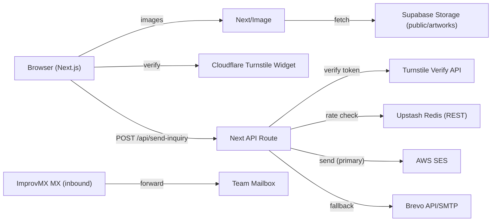
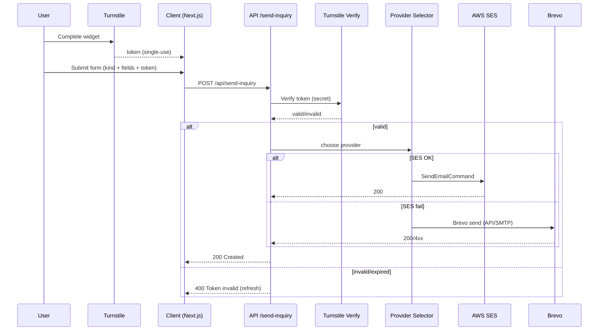

<div align="center">

# SmitsArtStudio

**Immersive Next.js gallery for original paintings & inquiries**

<p>
  
  
  
  
  
  
  <br>
  
  
  
  
  
</p>

</div>

---

## Table of Contents

* [About](#about)
* [Tech Stack](#tech-stack)
* [Architecture](#architecture)
* [Features](#features)
* [Data & Assets](#data--assets)
* [Forms & Email Flow](#forms--email-flow)
* [Security & Verification](#security--verification)
* [Optimization](#optimization)
* [Domain & DNS Setup](#domain--dns-setup)
* [Troubleshooting Journey](#troubleshooting-journey)
* [License](#license)

---

## About

SmitsArtStudio is a Next.js (App Router) site showcasing fine‑art paintings with an immersive landing page, category‑driven catalog, media‑rich artwork pages, and a robust inquiry workflow. The stack emphasizes visual polish, fast loads, and a reliable multi‑provider email pipeline protected by Cloudflare Turnstile.

**Audience:** art buyers, galleries, curators, and commission seekers.

**Goal:** elegant viewing + frictionless, safe contact.

---

## Tech Stack

**Frontend**

* Next.js (App Router), TypeScript
* Tailwind CSS, shadcn/ui, lucide-react, Framer Motion

**Data & Media**

* Supabase Storage (`artworks` bucket, `derivatives` bucket: derivatives/watermarks)
* Next/Image with `remotePatterns` and local `/public` + `/api/media` proxy

**Email (multi‑provider)**

* **AWS SES** — primary transactional sender
* **Brevo (Sendinblue)** — secondary sender / marketing/newsletter; can serve as fallback transactional
* **ImprovMX** — inbound/forwarding (e.g., route `contact@` → team inbox)

**Protection & Hosting**

* Cloudflare **Turnstile** — bot protection (page‑level gate for forms)
* Vercel — hosting/deploy

**Utilities**
- Upstash Redis (REST) — per‑IP rate limiting for `/api/send-inquiry`
- Tailwind plugins: `@tailwindcss/forms`, `@tailwindcss/container-queries`

---

## Architecture



**Inquiry sequence**



---

## Features

* **Landing/Home:** immersive hero with slide‑aware color gradients and smooth button color transitions
* **Works (catalog):** category filters (Figurative, Landscape, Abstract, Prints)
* **Artwork Detail:** interior mockups + full image; hover/blur interplay
* **Contact:** three inquiry types (Artwork, Exhibition/Commission, General)
* **Bot protection:** Turnstile **page‑level** gate before rendering any form
* **Performance:** image optimization, lazy loading, caching
* **Accessibility:** alt‑text strategy, keyboard navigation, contrast checks

---

## Data & Assets

**Folder convention**

```
public/
  artworks-derivatives/
    <artwork-slug>/
      full_1600_wm.webp
      full_1200_wm.webp
      full_800_wm.webp
      full_480_wm.webp
      interior_1600_wm.webp
      interior_1200_wm.webp
      interior_800_wm.webp
      interior_480_wm.webp
```

**DB fields**
`id, slug, title, category, description, width_cm, height_cm, price, primary_image_url, media`

**Notes**

* Original asset size > 1 GB: compressed to < 100 MB with WebP derivatives.
* Supabase bucket `artworks-derivatives`

---

## Forms & Email Flow

**API route:** `/api/send-inquiry` with body `{ kind, fields..., turnstileToken }`

**Kinds & payload examples**

```json
// Artwork inquiry
{
  "kind": "artwork",
  "name": "Jane Doe",
  "email": "jane@example.com",
  "message": "Is this available?",
  "slug": "being-lotus",
  "title": "Being Lotus",
  "turnstileToken": "..."
}
```

```json
// Exhibition / Commission
{
  "kind": "exhibition",
  "name": "Curator X",
  "email": "x@museum.org",
  "organization": "Museum Org",
  "dates": "Oct–Dec 2025",
  "location": "Vancouver, BC",
  "brief": "Group show proposal...",
  "budget": "2000–4000",
  "turnstileToken": "..."
}
```

**Templates**

* Plain‑text fallback + simple HTML table per `kind` for mailbox readability.
* `Reply-To` set to the submitter’s email.

**Provider selection**

- **AWS SES — internal delivery (production)**
  - Sends a server-side copy of every inquiry **from** `no-reply@smitsartstudio.com` **to** the verified artist inbox.
  - Purpose: canonical archive/notification path to a guaranteed-delivery, verified mailbox.

- **Brevo — external outbound (production)**
  - Sends all outward-facing messages to inquirers (via domain).
  - Appears **From:** `contact@smitsartstudio.com` (sent via the `smitsetsy` Brevo account).

- **ImprovMX — inbound/forwarding**
  - Hosts MX for `contact@smitsartstudio.com`.
  - Forwards inbound mail to the actual team inbox (Gmail/Workspace).
  - Inbound comes via ImprovMX; outbound/replies are sent via **Brevo**.
    
---

## Security & Verification

* **Turnstile tokens are single‑use & short‑lived.** The site obtains a new token for **every** submission and after navigation.

 ### Rate limiting (Upstash Redis)
- Strategy: fixed window per IP or hashed email.
- Storage: Upstash Redis via REST (works on Vercel Edge or Node runtime).
- Failure mode: respond `429 Too Many Requests` with `Retry-After` header.
- Notes: enforce **after** Turnstile verify to avoid counting bot noise.

---

## Optimization

To avoid excessive Supabase storage egress charges and improve load times, the project implements several strategies:

- **Next.js Media Proxy (`/api/media`)**  
  All Supabase image requests are routed through a Next.js API endpoint.  
  - Vercel caches responses at the edge.  
  - Clients repeatedly hit Vercel’s CDN instead of pulling directly from Supabase.  
  - This drastically cuts down on Supabase egress traffic.

- **Next/Image configuration**  
  - `remotePatterns` allow direct Supabase storage URLs.  
  - `localPatterns` include `/api/media/**` and `/public/**`, ensuring both proxied and local assets work seamlessly.  
  - Prefer `/api/media` for artworks and derivatives; Supabase originals are never exposed.

- **CDN Cache**  
  - Vercel’s CDN layer caches proxied images, reducing repeat fetches.  
  - Cache headers ensure that once an artwork derivative is requested, subsequent loads are served from the edge without incurring additional Supabase traffic.  
  - Derivatives are immutable by convention (unique filenames per size/watermark), so cached versions never go stale.
 
- **Lazy Loading**  
  - Non-critical images (below the fold) use Next/Image’s built-in `loading="lazy"` to defer fetch until scrolled into view.  
  - Critical hero and detail images are marked `priority` for immediate load.  
  - This reduces initial bandwidth and improves perceived performance.

- **Responsive Sizing**  
  - Multiple derivative sizes (`480, 800, 1200, 1600`) are generated.  
  - The browser picks the smallest required version.
  - This prevents overserving giant images on mobile and saves egress.

---

## Domain & DNS Setup

1. **SPF**: include all sending providers I use

   * `v=spf1 include:amazonses.com include:spf.brevo.com ~all`
2. **DKIM**: publish DKIM CNAMEs for **SES** and **Brevo** (provider dashboards supply exact records).
3. **DMARC**: start at quarantine/none and monitor: `v=DMARC1; p=quarantine; rua=mailto:dmarc@domain.com; fo=1`.
4. **MX**: point to **ImprovMX** (e.g., `mx1.improvmx.com`, `mx2.improvmx.com`) to enable forwarding.

---

## Troubleshooting Journey

* **400 “token expired/invalid” after one submit** → Turnstile tokens are single‑use. Refresh token before re‑submit and on route changes.
* **Two Turnstile widgets appear after slug→contact** → Mount **once** at page level; unmount on route change; avoid nested renders.
* **SES 403 / Email not sending** → Verify identity and region; check `From` matches verified sender; monitor bounces.
* **Brevo 401/403** → API key invalid/insufficient scope; confirm sender verification.
* **Deliverability (550/554)** → Check SPF includes and DKIM for the active provider; DMARC policy too strict; warm up sending.
* **Images 403/slow** → Revisit `remotePatterns`, public bucket policy, or image proxy route; ensure Vercel cache headers.
**429 Too Many Requests** → You hit the Upstash limit. Reduce testing frequency or raise `RATE_LIMIT_MAX`.
**403 from Upstash** → Invalid REST token or wrong URL region. Re‑paste credentials and redeploy.


---

## License
This project is proprietary. All rights reserved.
